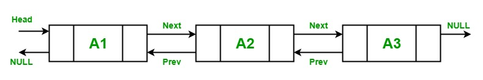

A LinkedList is a linear data structure which stores element in the non-contiguous location. The elements in a linked list are linked with each other using pointers. Or in other words, LinkedList consists of nodes where each node contains a data field and a reference(link) to the next node in the list.
In Tuval Framework, You can use  generic type of LinkedList object in typescript. It is a doubly linked list, therefore, each node points forward to the Next node and backward to the Previous node. It is a dynamic collection which grows, according to the need of your program. It also provides fast inserting and removing elements.


## LinkedList< T > Characteristics

* The LinkedList class implements the ICollection< T >, IEnumerable< T > and IReadOnlyCollection< T > interfaces.
* It also supports enumerators.
* You can remove nodes and reinsert them, either in the same list or in another list.
* Every node in a LinkedList< T > object is of the type LinkedListNode< T >.
* It does not support chaining, splitting, cycles, or other features that can leave the list in an inconsistent state.
* If the LinkedList is empty, the First and Last properties contain undefined.
* The capacity of a LinkedList is the number of elements the LinkedList can hold.
* In LinkedList, it is allowed to store duplicate elements.

A LinkedList class has 2 constructors which are used to create a LinkedList which are as follows:

| Name                    | Description                                                                                                                                                                                                   |
|-------------------------|---------------------------------------------------------------------------------------------------------------------------------------------------------------------------------------------------------------|
| LinkedList()            | This constructor is used to create an instance of the LinkedList class that is empty.                                                                                                                         |
| LinkedList(IEnumerable) | This constructor is used to create an instance of the LinkedList class that contains elements copied from the specified IEnumerable and has sufficient capacity to accommodate the number of elements copied. |

LinkedList provides 4 different methods to add nodes and these methods are:

| Name      | Description                                                                               |
|-----------|-------------------------------------------------------------------------------------------|
| AddAfter  | This method is used to add a new node or value after an existing node in the LinkedList.  |
| AddBefore | This method is used to add a new node or value before an existing node in the LinkedList. |
| AddFirst  | This method is used to add a new node or value at the start of the LinkedList.            |
| AddLast   | This method is used to add a new node or value at the end of the LinkedList.              |

The elements of the LinkedList is accessed by using a foreach loop or by using for loop. As shown in the below example.

```tsx
    //Typescript

    // Creating a linkedlist
    // Using LinkedList class
    const my_list: LinkedList<string> = new LinkedList<String>();

    // Adding elements in the LinkedList
    // Using AddLast() method
    my_list.AddLast("Zoya");
    my_list.AddLast("Shilpa");
    my_list.AddLast("Rohit");
    my_list.AddLast("Rohan");
    my_list.AddLast("Juhi");
    my_list.AddLast("Zoya");

    Console.WriteLine("Best students of XYZ university:");

    // Accessing the elements of
    // LinkedList Using foreach loop
    foreach(my_list:(str: string)=>{
        Console.WriteLine(str);
    });
```

In LinkedList, it is allowed to remove elements from the LinkedList. LinkedList< T > class provides 5 different methods to remove elements and the methods are:

| Name                   | Description                                                                                    |
|------------------------|------------------------------------------------------------------------------------------------|
| Clear()                | This method is used to remove all nodes from the LinkedList.                                   |
| Remove(LinkedListNode) | This method is used to remove the specified node from the LinkedList.                          |
| Remove(T)              | This method is used to remove the first occurrence of the specified value from the LinkedList. |
| RemoveFirst()          | This method is used to remove the node at the start of the LinkedList.                         |
| RemoveLast()           | This method is used to remove the node at the end of the LinkedList.                           |

```tsx
        //Typescript

        const my_list:LinkedList<string> = new LinkedList<string>();

        // Adding elements in the LinkedList
        // Using AddLast() method
        my_list.AddLast("Zoya");
        my_list.AddLast("Shilpa");
        my_list.AddLast("Rohit");
        my_list.AddLast("Rohan");
        my_list.AddLast("Juhi");
        my_list.AddLast("Zoya");

        // Inital number of elements
        Console.WriteLine('Best students of XYZ ' + 'university initially:');

        // Accessing the elements of
        // Linkedlist Using foreach loop
        foreach(my_list, (str: string)=>{
            Console.WriteLine(str);
        });


        // After using Remove(LinkedListNode)
        // method
        Console.WriteLine('Best students of XYZ' + ' university in 2000:');

        my_list.Remove(my_list.First);

        foreach(my_list, (str: string)=>{
            Console.WriteLine(str);
        });

        // After using Remove(T) method
        Console.WriteLine('Best students of XYZ' + ' university in 2001:');

        my_list.Remove("Rohit");

        foreach(my_list, (str: string)=>{
            Console.WriteLine(str);
        });

        // After using RemoveFirst() method
        Console.WriteLine('Best students of XYZ' + ' university in 2002:');

        my_list.RemoveFirst();

        foreach(my_list, (str: string) => {
            Console.WriteLine(str);
        });

        // After using RemoveLast() method
        Console.WriteLine('Best students of XYZ' + ' university in 2003:');

        my_list.RemoveLast();

        foreach(my_list,(str: string)=>{
            Console.WriteLine(str);
        });

        // After using Clear() method
        my_list.Clear();
        Console.WriteLine("Number of students: {0}", my_list.Count);
```

In LinkedList, you can check whether the given value is present or not using the Contains(T) method. This method is used to determine whether a value is in the LinkedList.

```tsx
        // Typescript

        const my_list:LinkedList<string> = new LinkedList<string>();

        // Adding elements in the Linkedlist
        // Using AddLast() method
        my_list.AddLast("Zoya");
        my_list.AddLast("Shilpa");
        my_list.AddLast("Rohit");
        my_list.AddLast("Rohan");
        my_list.AddLast("Juhi");

        // Check if the given element
        // is available or not
        if (my_list.Contains("Shilpa") === true) {
            Console.WriteLine("Element Found...!!");
        }
        else {
            Console.WriteLine("Element Not found...!!");
        }
```