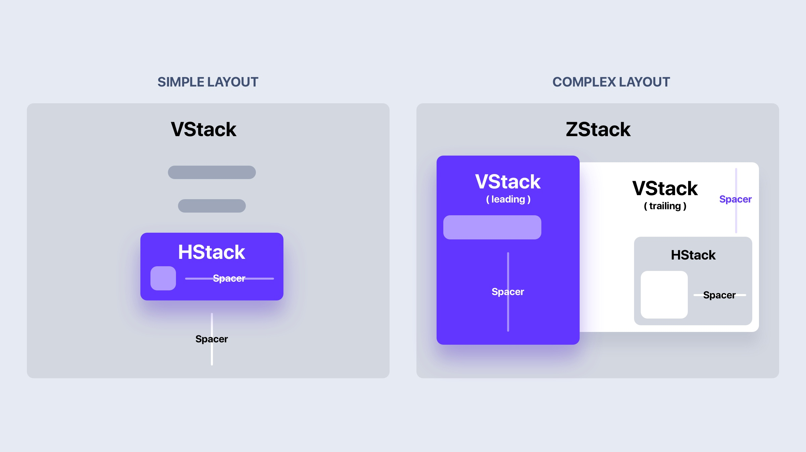

Stacks in Tuval Framework are combining views in horizontal and vertical stacks, you can build complex user interfaces for your application. There are 3 types of stacks: HStack, VStack and ZStack.

>


## VSTACK

The VStack allows you to stack views vertically, from top to bottom. You can further customize the view by adding alignment or spacing to the VStack.

``` ts
VStack(alignment: cLeading, spacing: 16) {
	Text("Hello, world!")
		.font(cTitle)
	Spacer()
	Text("Second line")
}
```
>

## HSTACK

The HStack is used to stack views horizontally. Just like the VStack, you can set the alignment and space items.

``` ts
HStack(alignment: cBottom, spacing: 16) {
	Text("Hello, world!")
		.font(cTitle)
	Spacer()
	Text("Second line")
}
```
>

## SPACER

By default, stacks in Tuval Framework will take the maximum space and align to the center. The Spacer is essential for pushing the content to use the maximum space. It can be useful for aligning elements as well.

``` ts
HStack(alignment: cBottom, spacing: 16) {
	Text("Hello, world!")
		.font(cTitle)
	Spacer()
	Text("Second line")
}
.padding()
.frame(width: 320)
```

## ZSTACK

ZStack is great for overlapping content. It stacks layers on top of each other, in a 3 dimentional plane. Since elements can float on top of each other, the alignment for ZStack will move all items at one.

``` ts
ZStack(alignment: cTopLeading) {
    Rectangle()
        .foregroundColor(Color.blue)
    Text("Hello, world!")
        .font(cTitle)
    Spacer()
    Text("Second line")
}
.padding()
.frame(width: 320)
```
>